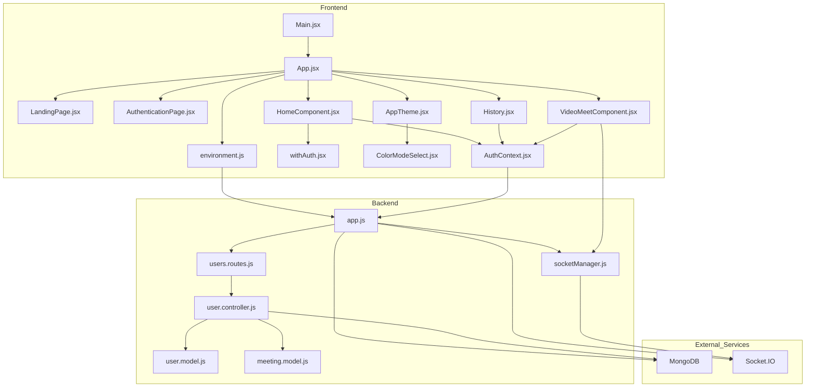

    

    <b>Automatic Architecture Diagrams from Code</b> 
    <a href="https://github.com/JashanMaan28/swark-continued">GitHub (Fork)</a> • <a href="https://github.com/swark-io/swark">Original Project</a>

## Usage Instructions

1. **Render the Diagram**: Use the links below to open it in Mermaid Live Editor, or install the [Mermaid Support](https://marketplace.visualstudio.com/items?itemName=bierner.markdown-mermaid) extension.
2. **Recommended Model**: If available for you, use `gemini` [language model](vscode://settings/swark-continued.languageModel). It can process more files and generates better diagrams.
3. **Iterate for Best Results**: Language models are non-deterministic. Generate the diagram multiple times and choose the best result.

## Generated Content
**Model**: GPT-4o - [Change Model](vscode://settings/swark-continued.languageModel)  
**Mermaid Live Editor**: [View](https://mermaid.live/view#pako:eNp1lFFvmzAQx79K5Oc2igmQNA-TYrKpkxZtUqq9mGny4ArewEbGdKmqfvcZbLbY6fzE7_7n8_0PwwsqZAloh3JRKdbVi4dDLhZm9cMPG_igpNAgShse1x7TI-Ni-bM_f7uIRnTfdWFwTT8xUXJRfWEVhGJM94OuQWheMM2leCsnofeyhUy2nRQmM5RTes97LdVzKGzoV16CPALo_27eTudno7_zlXhHf3Ndjwmhglej04ca2qtuMaaZbKQ6mqGeoIHiqiyOKIgnboba2o6cOE04GD1hxS9v8gRTNs34oiKJ6NCD6pdKDhr6QFxP4rIwHpVsGvPo6zHtpTlEH5kwww_VxO5ujZsmkFLamtGaFxuqbxl5f9agBGu-n0A98QL6f4Uyc5mkqOSBXFTPInqa2lp-_Hxddo8Xt7fvzIVzGFlc-xj7mPiY-rhxmFjcOkx93Pjoku_8Ung1d7lyARwkRLMRYo0QZ4TYBOKMkLXFxMfU3xt7mM2lYh-dir1SI869uqPnVrc-bv6ehW5QC6plvDT_jJcc6fEryNFukaMSHtnQ6By9mqShK5mGA2fmArRop9UAN4gNWp6eRTGzubFVjXaPrOnh9Q8EYUES) | [Edit](https://mermaid.live/edit#pako:eNp1lFFvmzAQx79K5Oc2igmQNA-TYrKpkxZtUqq9mGny4ArewEbGdKmqfvcZbLbY6fzE7_7n8_0PwwsqZAloh3JRKdbVi4dDLhZm9cMPG_igpNAgShse1x7TI-Ni-bM_f7uIRnTfdWFwTT8xUXJRfWEVhGJM94OuQWheMM2leCsnofeyhUy2nRQmM5RTes97LdVzKGzoV16CPALo_27eTudno7_zlXhHf3Ndjwmhglej04ca2qtuMaaZbKQ6mqGeoIHiqiyOKIgnboba2o6cOE04GD1hxS9v8gRTNs34oiKJ6NCD6pdKDhr6QFxP4rIwHpVsGvPo6zHtpTlEH5kwww_VxO5ujZsmkFLamtGaFxuqbxl5f9agBGu-n0A98QL6f4Uyc5mkqOSBXFTPInqa2lp-_Hxddo8Xt7fvzIVzGFlc-xj7mPiY-rhxmFjcOkx93Pjoku_8Ung1d7lyARwkRLMRYo0QZ4TYBOKMkLXFxMfU3xt7mM2lYh-dir1SI869uqPnVrc-bv6ehW5QC6plvDT_jJcc6fEryNFukaMSHtnQ6By9mqShK5mGA2fmArRop9UAN4gNWp6eRTGzubFVjXaPrOnh9Q8EYUES)

